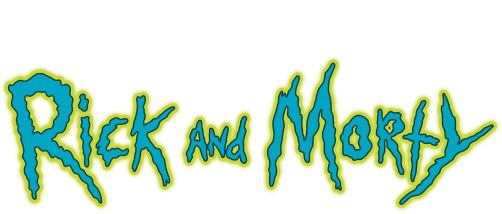
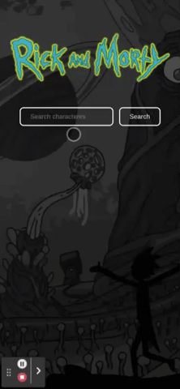

<div align="center">
  
  <h2>Frontend Challenge inGaia</h2>
  
  
  
  <h3 align="justify">
    This is an application based on a frontend challenge proposed by inGaia company, where the user must be able to search for characters from Rick and Morty cartoon and see more details about them.
  </h3>
  <p align="center">
    <a href="#💻-how-it-works">How it works</a> •
    <a href="#📥-installation">Installation</a> •
    <a href="#🚀-usage">Usage</a> • 
    <a href="#🧪-test">Test</a> • 
    <a href="#🛠-tech-stack">Tech Stack</a> • 
    <a href="#👩‍💻-author">Author</a> • 
    <a href="#📝-license">License</a>
  </p>
</div>

---

## 💻 How it works

<p align="justify">
  You should type a character name into the input and then a list of results will be shown with the matching search. If you want to see more details about a specific character, you should click on the card and them a modal will open with the information. 
</p>

  <div align="center">
    <h3>Desktop Layout</h3>
    
    <h3>Mobile Layout</h3>
    
  </div>

---

## 📥 Installation

To locally build the application, you must install the dependencies by running in the project directory the command:

```bash
yarn
```

---

## 🚀 Usage

To start the project locally, you must run command:

```bash
yarn start
```

And then open [http://localhost:3000](http://localhost:3000) to view the application in the browser.

---

## 🧪 Test

If you want to test the application in the interactive watch mode you must run command:

```bash
yarn test
```

---

## 🛠 Tech Stack

The following tools were used in the construction of the project:

- [React](https://pt-br.reactjs.org/)
- [TypeScript](https://www.typescriptlang.org/)
- [Styled-Components](https://styled-components.com/)
- [React Testing Library](https://testing-library.com/)
- [Apollo Graphql](https://www.apollographql.com/)

---

## 👩‍💻 Author

Made with ❤️ by Nadine Meyer Ouro 👋🏽 Contact me!

[](https://www.linkedin.com/in/nadine-ouro/)
[](mailto:nadine.meyer.ouro@gmail.com)

---

## 📝 License

This project is under the license MIT.
